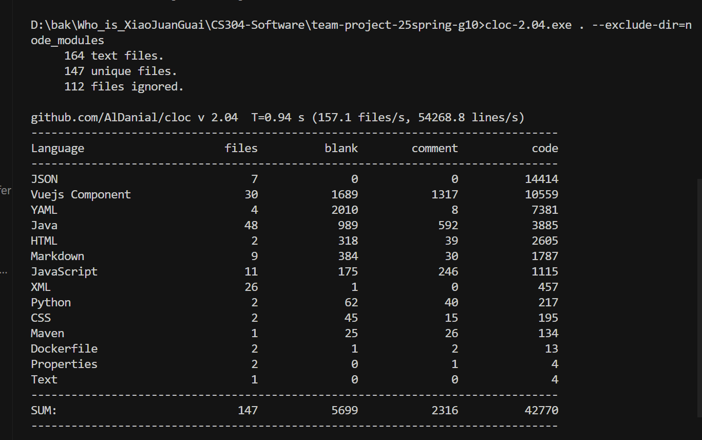
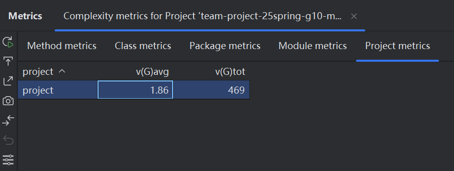
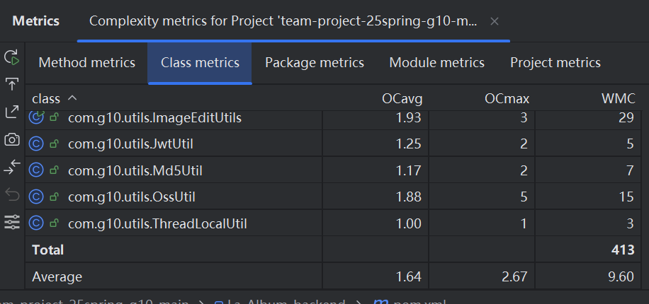
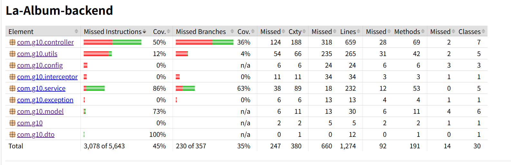

# [CS304] Team Project - Sprint 2 Report

## Part I.  Metrics (1 point)

- **Lines of Code** : 42770
- **Number of source files**: 147
   
- **Cyclomatic complexity**: 469
   
- **Number of dependencies**: 413
  

## Part II. Documentation (2 Points)

### ✅ 用户文档（End User Documentation）

我们提供了完整的用户文档 [End User Documentation](..\End_User_Documentation)

- 注册/登录流程
- 基础功能
- 上传照片
- 智能分类
- 照片编辑
- 生成回忆视频
- 分享

#### ✅ 开发者文档（Developer Documentation）

我们维护了一个开发者文档，详见：[Developer Guide](..\Developer_Guide)

内容包括：
- 核心设计原则
- 后端接口文档（SpringBoot REST API）
- 前端view和组件概述
- 数据库实体关系

## Part III.  Tests (2 Points)

后端使用JUnit 5和Mockito 进行测试, 使用Jacoco生成测试覆盖报告。  

前端使用Jest进行测试。

## Part IIII.  Build and Deploy(2 Points)

Use github actions and docker to build and deploy.  

