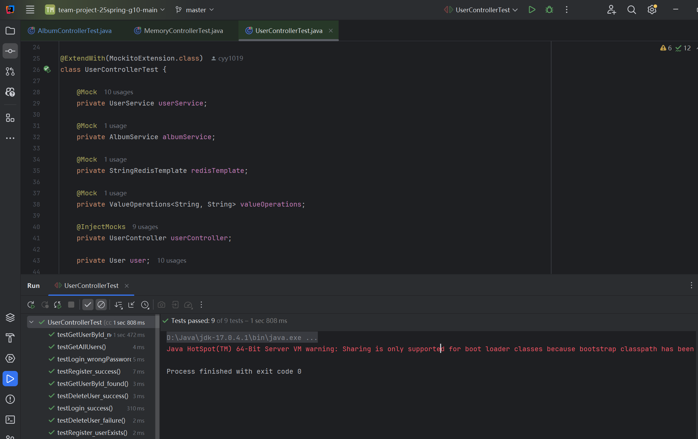
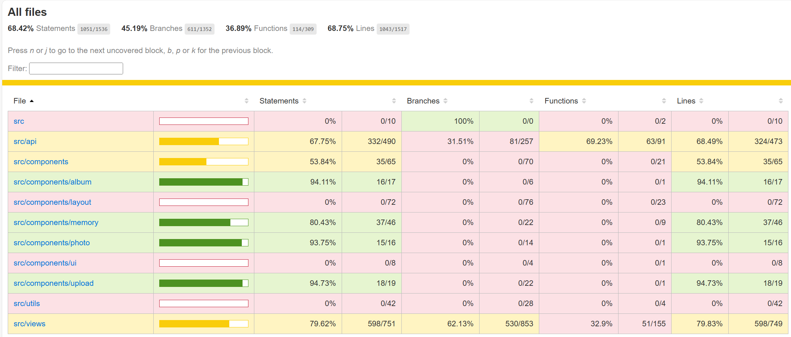
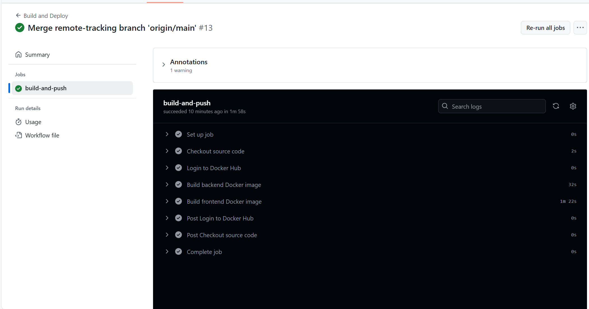
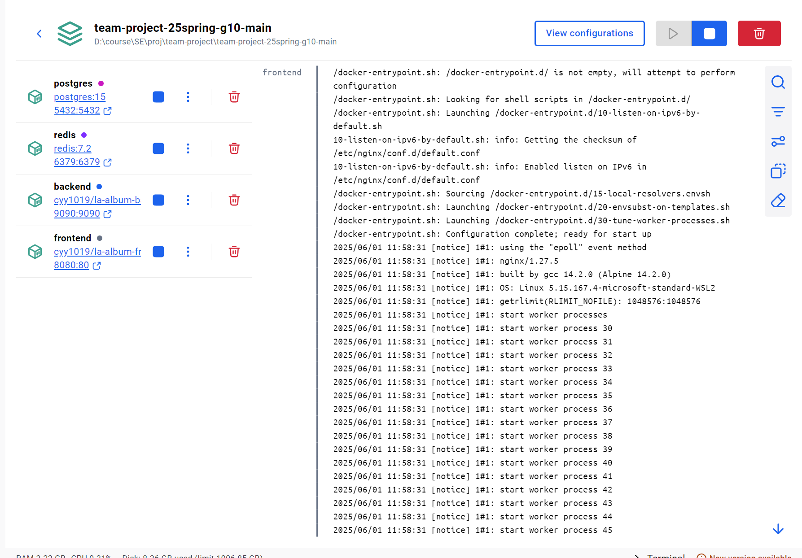

# [CS304] Team Project - Sprint 2 Report

## Part I.  Metrics (1 point)

- **Lines of Code** 
- **Number of source files** 
- **Cyclomatic complexity** 
- **Number of dependencies**

## Part II. Documentation (2 Points)

### ✅ 用户文档（End User Documentation）

我们提供了完整的用户文档 [End User Documentation](docs\End_User_Documentation.md)，包含：

- 注册/登录流程
- 上传照片与智能分类说明
- 相册故事视频生成使用指南
- 协作相册设置方式
- 社交分享与平台推荐操作说明

示意截图如下：  
  


#### ✅ 开发者文档（Developer Documentation）

我们维护了一个开发者文档，详见：[Developer Guide](docs\Developer_Guide.md)

内容包括：

- 项目结构概览
- 数据模型设计（ER图）
- 后端接口文档（SpringBoot REST API）
- AI 分类模块说明（调用流程 + 标签处理）
- 构建 & 部署说明（Dockerfile + CI/CD）

关键文件路径：

- `backend/src/main/java/com/album/controller/`：控制器层  
- `frontend/src/components/`：Vue 组件  
- `docker-compose.yml`：部署配置

## Part III.  Tests (2 Points)
后端使用JUnit 5和Mockito 进行测试, 使用Jacoco生成测试覆盖报告。  

前端使用Jest进行测试。


## Part IIII.  Build (2 Points)
使用github actions 完成自动化build和deploy流程:   
   
执行后可以上传到dockerhub，本地拉取并运行：
   

### 1. Architectural Design

#### 📌 Architecture Overview

我们采用 **前后端分离的客户端-服务器架构（Client-Server）**，以便支持可拓展性和模块化开发。系统由以下几个核心组件构成：

- **Frontend (Vue)**：提供用户界面，负责处理用户交互。
- **Backend (Spring Boot / JPA)**：提供 API 服务，处理用户请求、操作数据库等。
- **Database (PostgresSQL / 阿里云)**：用于持久化存储用户信息、照片、相册信息等。
- **Model Layer（AI 功能）**：调用训练好的模型完成特定功能，比如根据用户描述筛选照片等。

#### 🧩 Component Interaction Diagram

- **Backend Architecture**
  

- **Entity Relationship**
  

#### 📖 Architecture Rationale

- 前后端分离有利于并行开发，前端团队和后端团队可以独立迭代。
- 将 AI/模型服务封装为独立模块，便于后期更换或优化模型。
- 使用 RESTful API 保持接口清晰，增强系统可维护性。
- 数据库采用关系型或文档型存储，以满足灵活查询和结构化存储需求。

---

### 2. UI Design

我们使用 墨刀 工具完成 UI 设计，专注于系统核心交互界面。以下展示几个主要页面：

#### 🖼 UI 页面示意图

1. **Main Page**  
   功能：展示所有功能，推荐recent album，展示日期。
   

2. **My Album**  
   功能：展示该用户的所有相册，展示相册封面。 
   

3. **Search**  
   功能：提供search bar，支持用户在文本框中输入进行搜索，提供实时推荐。
   
4. **Memory Genrate**
   功能：支持用户选择相册，视频风格等生成memory。展示过往生成的memory。
   

5. **Sharing**
   功能：支持用户分享相册和照片。
   


> 说明：UI 图为草图设计，与最终实现可能有所不同。我们设计 UI 的主要目的是在开发初期达成共识，提高沟通效率。

---

## Part II. Process & Collaborations (2 points)

### 1. Github Project board（第 2 次 Sprint）

- 已更新 Sprint 2 的看板任务，包括：
  - 优先级划分
  - 每个成员的具体任务和截止时间
  - 任务状态标注（Todo/In Progress/Done）
    <!-- - 任务以 User Story 形式整理，例如：
  - 作为玩家，我希望有一个游戏化的关卡 UI，以获得沉浸式体验。
  - 作为开发者，我希望有一个代码编辑器来调试逻辑模块。 -->

### 2. Git 协作流程

- 每位成员使用个人分支进行开发，开发完成后通过 Pull Request 合并到主分支。
- Commit 遵循语义化命名，例如：`feat: add login component`，`fix: resolve API timeout`
- GitHub Insights 显示多成员活跃提交，避免“独狼开发”现象。
- 开发分支：`main`、`frontend-dev`、`backend-dev`、`level-logic` 等
- 我们确保每次合并前都有代码 review，防止破坏主线功能。

---

## Part III. Sprint Review (5 points)

在 Sprint 1 中，我们已实现以下主要功能：

- ✅ UI 原型图设计完毕，涵盖所有核心模块
- ✅ 前后端基础框架完成，可交互页面已实现部分功能
- ✅ GitHub 项目看板使用规范，任务分配明确
- ✅ 初步尝试使用AI agent

<!-- 我们将在演示中运行系统，展示以上功能的真实效果。 -->

<!-- > 注意：虽然目前进度略落后于最初计划（原定完成 3 个功能模块），但我们已识别瓶颈并制定补救计划，包括强化前后端联调与代码 review 流程。 -->

---

## Part IV. AI Usage (1 point)

### 设计相关的 AI 使用（已填写问卷）

- 辅助后端架构设计
- 辅助关系表设计

<!-- ### 2. 编码相关的 AI 使用

我们在部分代码中使用 AI 工具辅助生成逻辑代码，例如：

```python
# AI-generated-content
# tool: ChatGPT
# version: 4.0
# usage: Used the prompt "generate Flask route for submitting game result"
@app.route("/submit", methods=["POST"])
def submit_result():
    ... -->
```